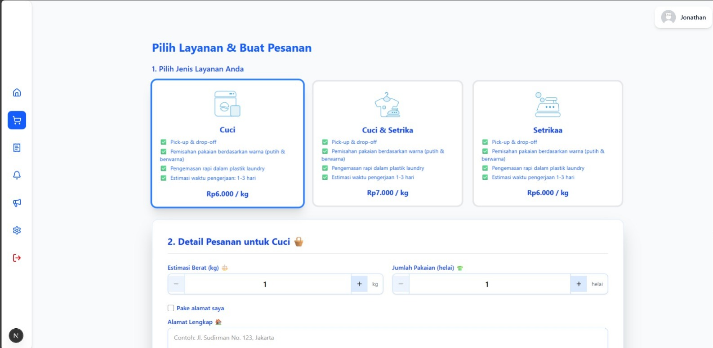
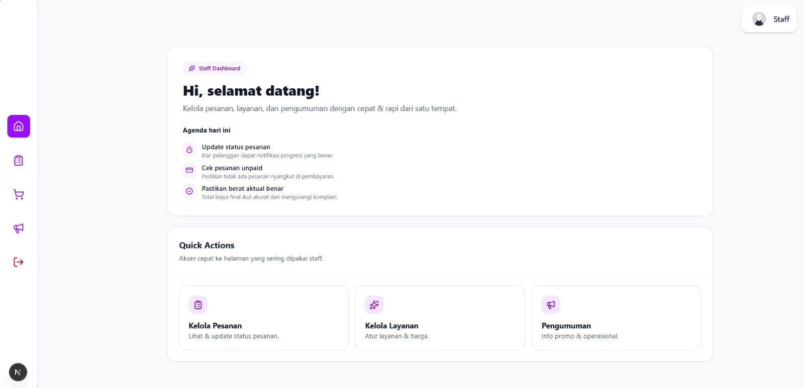

# ☁️ Laundry-Go

**Laundry-Go** is a modern, full-stack laundry management web application built with Next.js and Supabase. It streamlines the entire laundry process—from customer order placement and staff pickup to weight-based dynamic pricing and automated notifications.

---

## ✨ Key Features

### 👤 Customer Side

- **Flexible Registration:** Supports manual sign-up or instant Google OAuth integration
- **Intuitive Ordering:** Choose laundry services, set pickup/delivery schedules, and manage addresses
- **Dynamic Payments:**
  - **QRIS:** Pay via QR code after the laundry is weighed at the shop
  - **COD:** Pay in cash upon delivery
- **Real-time Tracking:** Monitor your laundry status through a detailed progress timeline
- **Notifications:** Get alerts for status changes and important announcements

### 👷 Staff/Admin Side

- **Order Dashboard:** Manage all active and historical orders in a structured table
- **Weight Verification:** Input actual weight to trigger automatic price calculations for customers
- **Operational Control:** Advance order statuses from "Pickup" to "Finished" with automated logic
- **Order Cancellation:** Securely cancel orders; once cancelled, all inputs are automatically locked to preserve data integrity
- **Announcements:** Post news or holiday schedules directly to the customer dashboard

---

## 🛠 Tech Stack

- **Framework:** [Next.js](https://nextjs.org/) (App Router)
- **Styling:** [Tailwind CSS](https://tailwindcss.com/)
- **UI Components:** [shadcn/ui](https://ui.shadcn.com/)
- **Database & Auth:** [Supabase](https://supabase.com/)
- **State Management:** React Context API
- **Code Linting:** [Biome](https://biomejs.dev/)

---

## 📁 Project Structure

```
src/
├── app/                # Next.js App Router (Routes & API)
│   ├── api/           # Backend endpoints (Payments, Auth, Roles)
│   ├── orders/        # Customer order history and details
│   ├── staff/         # Dedicated Staff/Admin portal
│   └── settings/      # Profile and address management
├── components/         # Reusable UI components
│   ├── staff/         # Admin-specific components (OrdersTable, etc.)
│   └── ui/            # Radix-based base UI (buttons, inputs, etc.)
├── contexts/          # Auth and User global state
├── lib/               # Configurations (Supabase client, utils)
└── utils/             # Business logic and notification helpers
```

---

## 🚀 Getting Started

### 1. Prerequisites

- Node.js (Latest LTS)
- A Supabase Project

### 2. Environment Setup

Create a `.env.local` file in the root directory and add your credentials:

```env
NEXT_PUBLIC_SUPABASE_URL=your_supabase_url
NEXT_PUBLIC_SUPABASE_ANON_KEY=your_supabase_anon_key
# Add payment gateway keys if applicable
```

### 3. Installation

```bash
npm install
```

### 4. Run Development Server

```bash
npm run dev
```

Open [http://localhost:3000](http://localhost:3000) with your browser to see the result.

---

## 🔄 Order Workflow

1. **Placement:** User makes an order; status is _Order Created_
2. **Pickup:** Staff picks up the laundry; status moves to _Pickup_
3. **Weighing:** Staff inputs the weight in the Admin Panel
4. **Payment:** User receives a notification to pay the final price
5. **Processing:** Laundry is washed and ironed
6. **Delivery:** Clean laundry is delivered back to the customer
7. **Finished:** Customer receives laundry and transaction is closed

---

## 📸 Screenshots

Compare the user experience between the customer service selection and the administrative control panel.

<div align="center">
  
  ### 🛍️ Customer Service Selection
  *User picks their desired laundry service*
  

  <br/>

### 🛠️ Staff Dashboard

_Admin manages orders, weights, and statuses_


</div>

---

## 👥 Contributors

Thanks to the following people who have contributed to **Laundry-Go**:

<table align="center">
  <tr>
    <td align="center">
      <a href="https://github.com/fae-ld">
        <br />
        <sub><b>fae-ld</b></sub>
      </a>
    </td>
    <td align="center">
      <a href="https://github.com/azzamybil">
        <br />
        <sub><b>azzamybil</b></sub>
      </a>
    </td>
    <td align="center">
      <a href="https://github.com/nisaintann">
        <br />
        <sub><b>nisaintann</b></sub>
      </a>
    </td>
    <td align="center">
      <a href="https://github.com/najmaqhistinaya">
        <br />
        <sub><b>najmaqhistinaya</b></sub>
      </a>
    </td>
  </tr>
</table>

---
